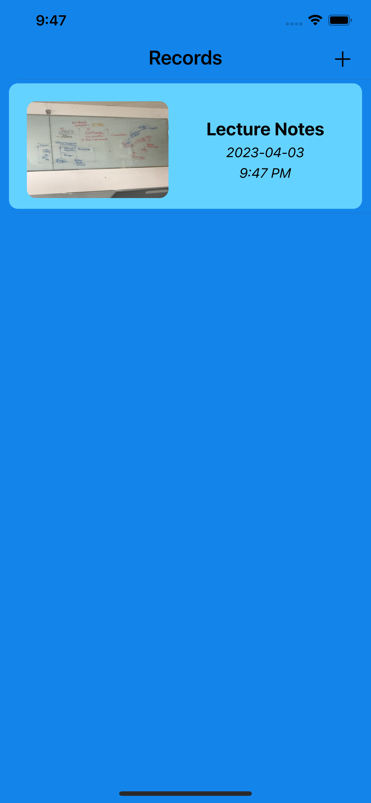
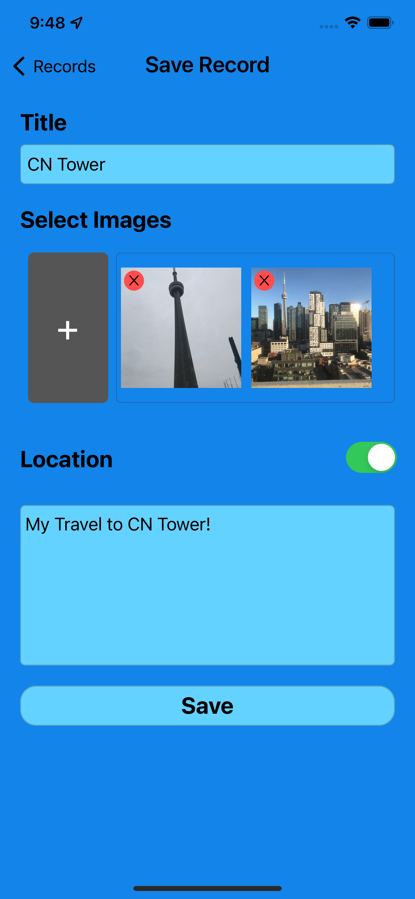
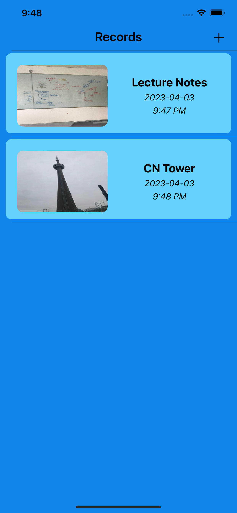
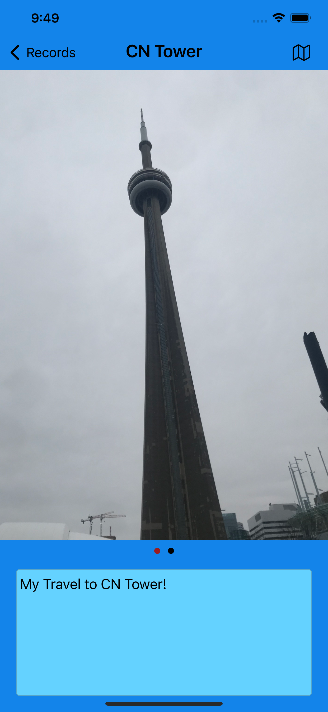
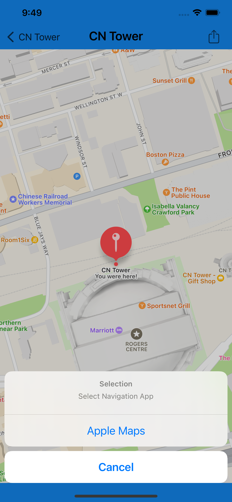

# MementoNotes
2
​
3
Open source code for my app on the App Store called Memento Notes, an app for taking notes while capturing the moment as well as saving your location locally via CoreData.

Whether you are a student who wants to easily classify your lecture notes while saving the date or a traveler who wants to save the newly discovered locations while capturing the moments, Memento Notes is a must-have app!

**Features:**

- Upload images from the photo library or take a picture with the camera. 

- Save the location where you created the note record. 

- Navigate to the saved location. 

- Take notes associated with your record. 

- Easily access locally saved records whenever you need them!

- Supports dark/light mode.

**Screenshots**

    

**Links:**

[Memento Notes in the App Store!](https://apps.apple.com/ca/app/id6447211081)

[3rd party library for Imageview.swift](https://github.com/michaelhenry/ImageViewer.swift)

[3rd party library for IQKeyboardManager](https://github.com/hackiftekhar/IQKeyboardManager)

Any questions or feedback is much appreciated! Feel free to contact me at canberk.yilmaz439@gmail.com
